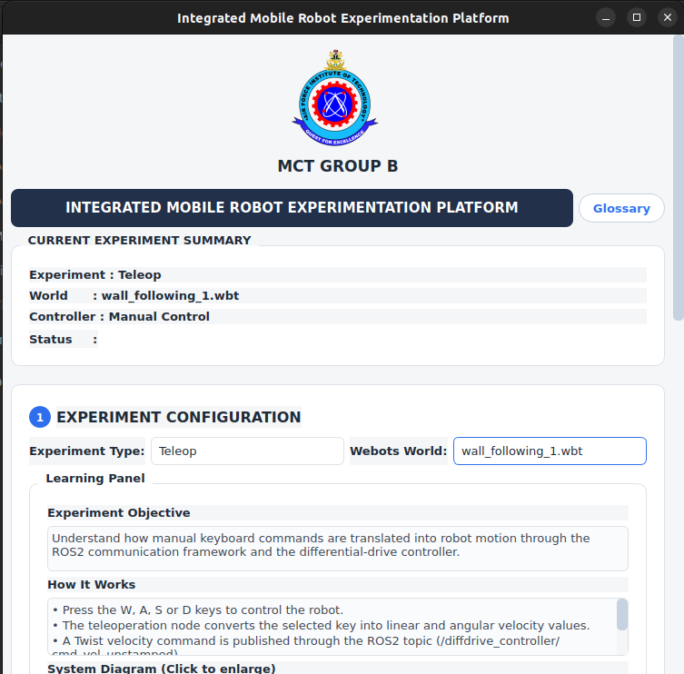
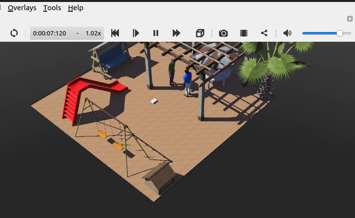

# A Tool for Simulation and Control of a Mobile Robot Using ROS 2 and Webots

An integrated experimentation platform for configuring, controlling, simulating, and evaluating mobile robot experiments using **ROS 2 Humble** and **Webots R2025a**. The platform provides a graphical user interface (GUI) that simplifies experiment setup while supporting common robotics algorithms such as teleoperation, wall following, trajectory tracking, and obstacle avoidance.

---

## Overview

Developing and evaluating mobile robot algorithms often requires launching multiple ROS nodes, configuring simulation environments, and manually collecting experimental results. This project integrates these tasks into a single platform that allows users to configure experiments through a graphical interface, execute simulations, and automatically collect performance data.

The platform combines:

- ROS 2 Humble
- Webots R2025a
- PyQt5 graphical user interface
- Docker for reproducible deployment

The project was developed as a final-year Mechatronics Engineering project.

---

## Features

- Graphical user interface for experiment configuration
- ROS 2 Humble integration
- Webots R2025a simulation
- Teleoperation using keyboard control
- PID wall-following controller
- Trajectory planning and tracking
- LiDAR-based obstacle avoidance
- Automatic experiment logging
- Performance monitoring
- Docker support for reproducibility

---

# Screenshots

## Graphical User Interface



The GUI provides a centralized interface for configuring experiments, selecting simulation worlds, and getting data for analysis.

---

## Webots Simulation Environment



Experiments are executed inside Webots using a differential-drive mobile robot equipped with sensors including LiDAR, IMU, GPS, and wheel encoders.

---

# Supported Software

| Component | Version |
|------------|---------|
| Ubuntu | 22.04 LTS |
| ROS | ROS 2 Humble |
| Webots | R2025a |
| Python | 3.10 |
| Docker | Latest |

---

# Repository Structure

```text
.
├── docs/
│   └── images/
│       ├── gui.png
│       └── a_world_file.png
├── ros2_ws/
│   └── src/
│       └── robot_simulation/
├── simulation_logs/
├── Dockerfile
├── docker-compose.yaml
├── .dockerignore
├── .gitignore
└── README.md
```

---

# Getting Started

## Clone the Repository

```bash
git clone https://github.com/<YOUR_USERNAME>/robot-simulation-control-tool.git
cd robot-simulation-control-tool
```

---

## Build the Docker Image

Build the Docker image once after cloning the repository.

```bash
docker compose build
```

---

## Start the Container

```bash
docker compose up -d
```

---

## Open a Terminal Inside the Container

```bash
docker exec -it robot_sim_test bash
```

---

## Launch the GUI

```bash
ros2 run robot_simulation gui
```

The GUI will appear on the host desktop using X11 forwarding.

---

# Available Experiments

## Teleoperation

Allows manual control of the mobile robot using keyboard commands. This experiment demonstrates how user inputs are translated into ROS 2 velocity commands and executed by the robot.

---

## Wall Following

Implements a PID-based wall-following controller. Users can modify controller gains through the GUI and evaluate the robot's tracking performance.

---

## Trajectory Planning and Tracking

Generates smooth waypoint-based trajectories and tracks them using a Pure Pursuit controller. Performance metrics and trajectory plots are automatically generated.

---

# Project Components

The project consists of:

- ROS 2 nodes
- Robot models (URDF)
- Webots worlds
- Controller implementations
- PyQt5 graphical interface
- Configuration files
- Docker environment

---

# Docker

The repository includes a fully configured Docker environment.

Included files:

- Dockerfile
- docker-compose.yaml

The Docker image contains:

- Ubuntu 22.04
- ROS 2 Humble
- Webots R2025a
- Required ROS packages
- Required Python dependencies
- Configured ROS workspace

---

# Simulation Logs

Simulation logs generated during experiments are stored on the host machine in

```text
simulation_logs/
```

This directory is automatically mounted into the Docker container.

---

# Future Work

Possible future improvements include:

- SLAM integration
- Navigation2 support
- Multi-robot simulation
- Additional robot platforms
- More experiment scenarios
- Additional evaluation metrics
- Support for external ROS packages

---

# Authors

- **Dauda Theophilus**
- **Bamikole John**
- **Ishaku Joseph**
- **Bisong Prince**

### Supervisors

- **Dr. K. O. Shobowale**
- **Engr. M. Habib**

---

# Citation

If you use this project in academic work, please cite the associated undergraduate thesis.

---

# License

This project is currently released without an open-source license.

All rights reserved by the authors.
